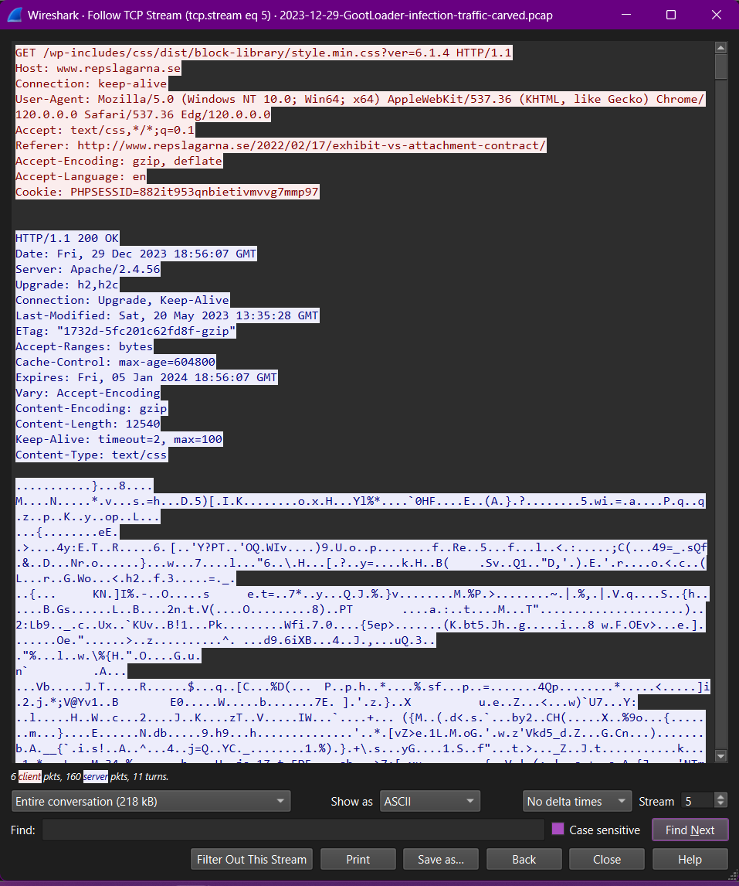
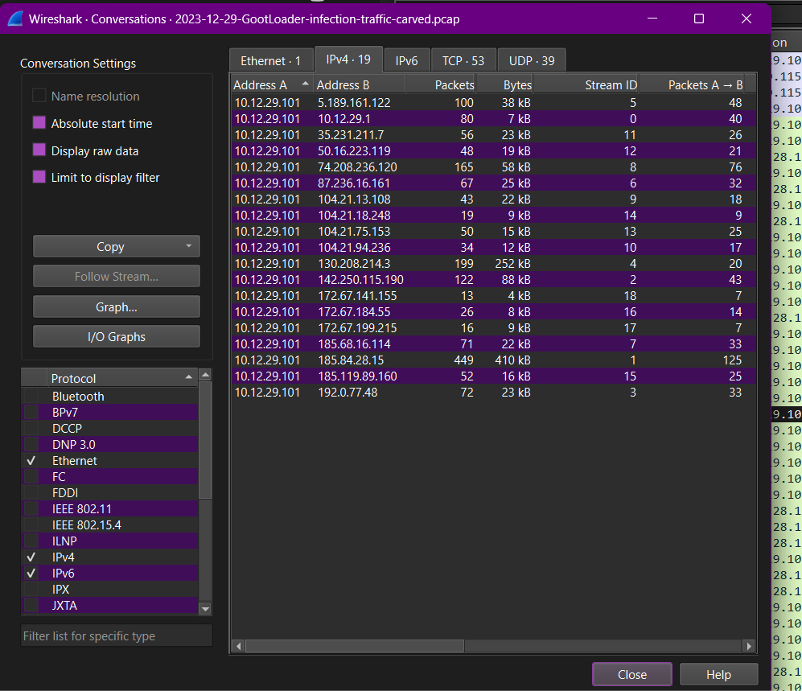
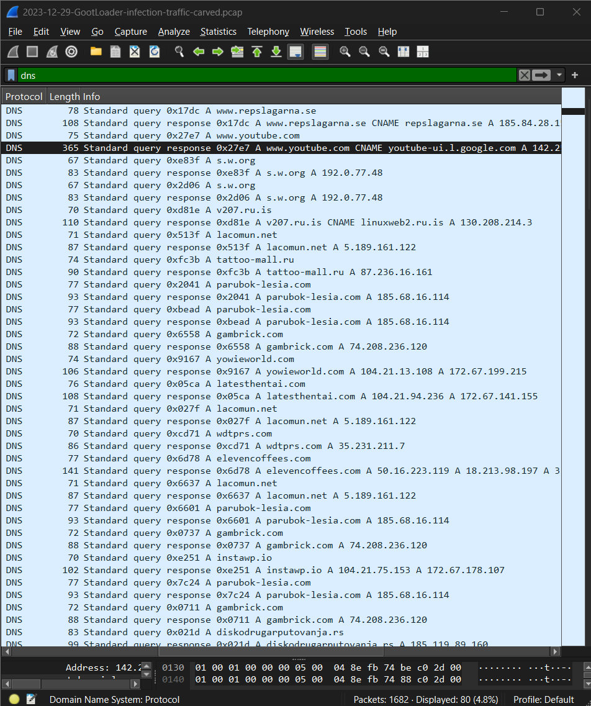

# soc-Investigations
Security Operations Center investigations including malware traffic analysis, phishing analysis, and threat detection projects.

---

# Investigation Screenshots

## DNS Analysis
Wireshark showing DNS queries from the infected host.

---

## HTTP Stream Analysis
HTTP stream showing connection to the malicious domain.

---

## Network Conversations
Communication between infected host and external infrastructure.

---

## Suspicious Domains
Multiple suspicious domains queried during the infection.

